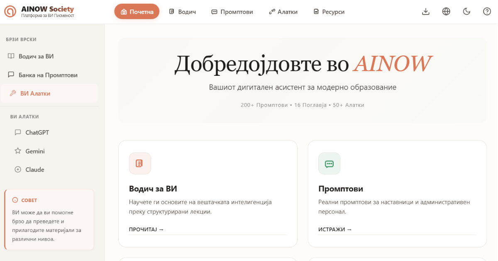

# AINOW Platform for AI Literacy

  <h3>The Open-Source AI Literacy Platform for Educators</h3>
  
  
Available at <a href="https://edu.ainow.mk">edu.ainow.mk</a>

---

## About The Project

As Artificial Intelligence reshapes education, the **AINOW Platform for AI Literacy** exists to ensure educators aren't left behind. We built an offline-first, deeply pedagogical Progressive Web App (PWA) to give teachers, principals, and school administrators the exact skills and tools they need to leverage AI in their daily work. 

Currently deployed for schools across the Balkans, the platform is proudly **100% open-source, zero-dependency, and strictly privacy-first**. No data ever leaves the device.

## Key Features

- **Interactive Learning Guide:** A 17-chapter curriculum (Foundations, Practice, Reference — including prompt engineering, RAG, performance, and safety) in MK, EN, and SQ.
- **Homework Sheets:** Chapter-aligned student tasks in Resources—print or PDF, with an optional teacher-only guidance block (per response field) in all three languages.
- **Massive Prompt Bank:** Over 300 high-quality, educator-tested prompts. From designing Flipped Classroom lesson plans to handling difficult parent conferences — organized by grade level and administrative role.
- **AI Tool Directory:** A curated list of 57 AI tools for classrooms, categorized by use-case (Planning, Multimedia, Assessment, etc.) with clear pricing badges.
- **AI Literacy Glossary:** 60-term glossary covering essential AI and education vocabulary, filterable by category, with live search — in all three languages.
- **Lightning Fast & Offline-Ready:** Built with vanilla HTML/CSS/JS. The built-in Service Worker ensures the platform works perfectly even when a school loses internet access.
- **Tri-Lingual:** Seamless, real-time language switching across English, Macedonian, and Albanian with full content parity.

---

## Built for Developers & Contributors

We intentionally designed the platform without heavy frameworks (React, Vue, etc.) or build steps (Webpack, Vite) so that **anyone with basic web skills can contribute**. 

### How to Run the App

This app is built to be as simple as possible for educators to use. You do not need to install any development tools, and you do not need an internet connection after downloading.

1. Download or clone this repository to your computer.
2. Double-click the `index.html` file to open it in your browser.

That's it! The platform is designed to run perfectly straight from your local files without the need for any server.

## How to Contribute

Whether it's adding new AI tools, translating the platform, or submitting new prompts for teachers — we need your help!

We have prepared a comprehensive **[Contribution Guide](CONTRIBUTING.md)** that explains exactly how to add data to the app, including:
1. Adding new Prompts to the Database
2. Adding new Educational AI Tools
3. Updating the AI Literacy Guide
4. Localization and Translation requirements

## Changelog

### v0.93 (April 27, 2026)
- **Onboarding refresh:** Reworked the welcome tour into a clearer 6-step onboarding flow with improved content coverage for navigation, resources, privacy, and responsible AI use.
- **Mobile-first modal UX:** Polished onboarding modal layout on phones (tighter spacing, improved typography, cleaner controls, and compact next/back/done navigation behavior).
- **Discoverability:** Added a dedicated onboarding reopen icon in header actions (next to Help) so users can relaunch the tour anytime.
- **Localization parity:** Updated onboarding and related help copy in **MK, EN, and SQ**, including title/subtitle and updated step guidance.
- **Release/cache sync:** Shipped with aligned version identifiers (`APP_VERSION v0.93`, `ai-edu-v0.93`, and `?v=93` assets) to avoid stale PWA cache issues.

### v0.92 (April 27, 2026)
- **Homework (Resources):** Ready-made student sheets per guide chapter in **MK, EN, and SQ**—print or PDF from Resource Builder. Optional **Насоки / Guidance / Udhëzime** checkbox adds per-field teacher marking notes (same idea as the test answer key: off by default).
- **Discoverability:** New **Homework** card on the **home** dashboard and **Help** (?), plus a **Homework** quick link in the sidebar on Home / Help / Resources.
- **Guide — Chapter parity:** The `prompts` guide module is in the Practice tab (`App._guideCategoryMap`), so all 17 `DOCS_DATA` sections are reachable from the UI.
- **Quizzes — Full topic coverage:** Assessment items for `prompt-advanced`, `memory-rag`, `performance-design`, and `safety-limits` in all three languages where Tests exposes those topics.
- **Prompt loading:** Language packs use `window.__embeddedPromptsByLang`; `I18n.loadLangData` assigns `embeddedPromptsData` after load for stable cross-language behaviour.
- **Housekeeping:** EN quiz/prompt cleanups as in prior notes; **version sync:** `v0.92` footer, `ai-edu-v0.92` service worker cache, `?v=92` on assets (`scripts/bump-version.ps1 -NewVersion 0.92`).

### v0.91 (April 26, 2026)
- **Prompt Bank — Administration Coverage:** Exposed the `department_head` subcategory in the Prompts UI and sidebar, restoring access to prompt sets that were already shipped in MK, EN, and SQ datasets.
- **Resources Shortcuts:** Replaced the home page `setTimeout(..., 10)` handoff to Resources with an async `App.openResourcesWidget(...)` flow, eliminating cold-load races when opening Tests, Guide handouts, and Prompt lists.
- **Service Worker Safety:** Tightened non-navigation fetch fallback behavior so failed JS/CSS/image/data requests no longer resolve to `index.html`. Cached assets still work offline, but broken asset requests now fail correctly instead of poisoning app boot with HTML.
- **Language Loading Robustness:** `I18n.loadLangData()` now clears `DOCS_DATA`, `embeddedPromptsData`, and `QUIZ_DATA` before loading the next language pack, preventing stale mixed-language state if a language file fails to load.
- **Header UX & Accessibility:** Fixed mobile menu click bubbling so opening the hamburger menu no longer triggers unintended navigation to Home. Added runtime translation support for `title` and `aria-label` attributes across header controls, keeping MK / EN / SQ labels synchronized after language switching.
- **Resources — Test Topic Integrity:** Switching quiz topics in Resources now clears hidden previous selections, preventing cross-topic export mistakes.
- **Version Sync:** Bumped release identifiers to `v0.91` / `ai-edu-v0.91` and updated all `?v=91` cache-busting query strings in `index.html`.

### v0.90 (April 17, 2026)
- **Accessibility — Keyboard & Screen Reader:** Added a "Skip to main content" link (shows on first Tab), translated to MK/EN/SQ. Focus-visible rings on all interactive controls (sub-pills, category tabs, guide tabs, feature cards, modal close button). Added `aria-label` to privacy modal close button.
- **Privacy Modal:** Full focus trap and auto-focus on open; focus returns to the trigger on close. Footer "Privacy First" trigger is now a real `<button>` instead of a clickable ``.
- **Copy Feedback:** Copying a prompt now shows a short translated "Copied ✓" toast (bottom of screen), in addition to the existing checkmark on the button — makes the action discoverable on mobile.
- **Empty States:** Prompts and glossary searches that return nothing now show an icon + friendly title + "Try a different search term" sub-line instead of a bare one-liner.
- **Mobile UX — Prompts Page:** Main category buttons (Teachers / Administration) now sit side-by-side as a 50/50 grid on phones instead of a horizontal-scroll strip. Guide chapter tabs (Foundations / Practice / Reference) use a 3-column equivalent. Sub-filter pills have a 38px touch target.
- **Dark Mode Fixes:** Glossary category badges (AI / Tech / Edu / Prompts) now resolve correctly in dark mode (selector was `.dark-theme`, app uses `[data-theme="dark"]`). Print button in Resources uses `--bg-card` instead of hard-coded white. Privacy modal body uses the correct `--text-primary` token.
- **Motion & Print:** Added `prefers-reduced-motion` support — all animations/transitions collapse for users with motion sensitivity. Added a full `@media print` stylesheet so teachers printing materials don't get UI chrome on the page.
- **Performance & Loading:** All external `<script>` tags use `defer`. Install banner image has `decoding="async"`. `<noscript>` fallback message in MK/EN/SQ for users without JavaScript.
- **Service Worker Robustness:** Install now uses `Promise.allSettled` per URL instead of `cache.addAll`, so one 404 won't break the whole install. Fetch handler is a three-tier strategy (exact cache → network → `ignoreSearch` fallback) — fixes offline use when URLs have cache-busting `?v=` query strings.
- **XSS Hardening:** `escapeHtml()` applied to all dynamic content injected into prompt cards, glossary cards, guide tabs, token counter widget, and PDF/print export (quiz questions, options, answer key, guide titles, prompt tags).
- **SEO:** Removed duplicate `<meta name="description">`. Added `#glossary`, `#about`, `#help` routes to `sitemap.xml`.
- **Version Sync Tooling:** Added `scripts/bump-version.ps1` that updates `APP_VERSION`, `CACHE_NAME`, and all `?v=` query strings in one shot to prevent drift.
- **Service Worker:** Cache bumped to `ai-edu-v0.90`.

### v0.86 (April 12, 2026)
- **Glossary Page:** New full-page AI/Education glossary accessible via the book icon in the header (top-right, next to the language switcher). Styled card grid with category sidebar filtering (AI, Tech, Education, Prompts) and live search. Works across all three languages.
- **60-Term Glossary:** Covers the core AI literacy vocabulary — AI/AGI/ANI/ASI, LLM, GPT, RAG, Fine-tuning, Foundation Model, Transformer, Attention, Multimodal AI, AI Agent, Chain of Thought, Deepfakes, Guardrails, Training Data, RLHF, Parameters, Temperature, Embedding, Reinforcement Learning, Supervised/Unsupervised Learning, Responsible AI, Digital Literacy, Data Privacy, and more. All 60 terms in MK, EN, and SQ.
- **Dynamic Home Stats:** The hero stat line on the home page now reads live counts from the actual data (`embeddedPromptsData`, `DOCS_DATA`, `App._toolsData`). Displays correct numbers automatically as content is added — no more hardcoded "200+ Prompts".
- **Data Alignment:** Audited and fixed Cyrillic/Latin script corruptions in `js/lang/mk/docs.js` (5 instances) and `js/lang/mk/prompts.js` (T-007, T-036, T-113). New quiz datasets added for EN, MK, SQ; new prompts (T-177+) added for MK — all verified aligned across languages.
- **Service Worker:** Cache bumped to force fresh delivery of updated JS and CSS assets.

### v0.85 (April 12, 2026)
- **Code Audit & Cleanup:** Full codebase review — no dead code, no broken references, no TODO/FIXME comments found. Clean bill of health.
- **Version Sync:** Aligned `APP_VERSION` (`app.js`) with `CACHE_NAME` (`service-worker.js`), which were 2 versions out of sync.
- **Removed Artifact:** Deleted `extglob` file from repo root (UTF-8 BOM artifact, 3 bytes, no content).
- **Tracked Libraries:** Added `js/lib/html2canvas.min.js` and `js/lib/jspdf.min.js` to git — they were untracked, causing PDF export to break on fresh clones.
- **Removed All Comments:** Stripped all `//` and `/* */` comments from source JS files (`app.js`, `views/resources.js`, `service-worker.js`).
- **Inline Styles → CSS:** Moved all inline `style=""` attributes from JS-generated HTML into proper CSS classes in `styles.css`. New classes: `.sidebar-ctx-wrap`, `.sidebar-section-header`, `.sidebar-tip-header`, `.sidebar-tip-icon`, `.sidebar-ai-tools`, `.sidebar-chapter-item`, `.sidebar-chapter-num`, `.sidebar-chapter-label`, `.sidebar-society-sep`, `.tools-cat-header`, `.tools-cat-icon`, `.tools-cat-title`, `.tools-cat-count`, `.page-hero-card-icon--secondary`, `.pcm-ai-dot--chatgpt/gemini/claude/perplexity`.
- **Sidebar Deduplication:** Extracted repeated AINOW Society social links (ainow.mk / GitHub / LinkedIn) into a single `_renderSidebarSocials()` method. Was duplicated 3× across `renderSidebarCtx`. All four `_renderSidebarAILinks*` methods also cleaned of inline styles.
- **Lazy Language Loading:** Removed hardcoded MK language scripts (`lang/mk/docs.js`, `prompts.js`, `quizzes.js`) from `index.html`. All language data now loads dynamically via `I18n.loadLangData()` based on the user's saved preference — no wasted bandwidth for EN/SQ users loading MK files.
- **Service Worker:** Cache bumped to `ai-edu-v0.85` to force eviction of old cached JS.

### v0.82 (April 11, 2026)
- **PDF Export — Two Buttons:** Resources view now has a "Save as PDF" button and a separate "Print" button. Both open a hidden iframe with the formatted document and trigger the browser print dialog — works offline, handles all scripts (Macedonian Cyrillic, Albanian, English), and works on mobile and desktop.
- **Export Fix:** Removed dead `#print-container` guard that silently blocked all exports. Export now works correctly on every click.
- **PWA Cleanup:** Removed dead `#pwa-install-btn` references (`_showInstallBtn`, `_hideInstallBtn`) from `app.js`.
- **Performance:** Fixed `innerHTML +=` in a loop in tools rendering — now builds the full string first and sets `innerHTML` once, eliminating N DOM reflows per tool card.
- **Null-Safety:** Added optional chaining on `.closest().querySelector()` chains in `copyPrompt`, `toggleAIMenu`, `openWithAI`. Added null check on widget button label in Resources. Added `|| val` fallback for quiz question preview.
- **i18n:** Added `resources.print_btn` translation key in MK, EN, SQ.
- **Service Worker:** Cache bumped to `ai-edu-v0.82`.

### v0.81 (April 11, 2026)
- **PWA Install — Fixed End-to-End:** Rewrote the entire PWA install flow with a single source of truth. Install button now shows only when the browser is actually ready to install (via `beforeinstallprompt`). iOS Safari shows a step-by-step bottom-sheet guide instead of a plain alert.
- **One-Time Install Banner:** A prominent install banner slides up from the bottom on first mobile visit, 2.5 seconds after load. Stored in `localStorage` so it only ever shows once per device.
- **Service Worker Overhaul:** Switched to network-first for navigation requests — fixes the blank page after PWA install. Cache bumped to `ai-edu-v0.81`.
- **Manifest Fixed:** Replaced broken `data:` URI icons with real SVG/PNG files. Changed `start_url` from absolute URL to `"/"` so the manifest is valid on both localhost and production — this was the root cause of `beforeinstallprompt` never firing.
- **Real Logo Assets:** Favicon and PWA icons now use `/assets/logo.svg` and `/assets/logo.png` (4000×4000). Maskable icon uses orange background for Android adaptive icons.
- **Mobile UI:** Hamburger menu hidden (footer nav handles all navigation). Custom styled checkboxes in Resources view. Pull-to-refresh indicator uses brand orange instead of green.
- **Nav Icons:** Reduced stroke-width from 2 to 1.5 for a lighter, more refined look.
- **iOS Install Guide:** Beautiful animated bottom-sheet with 3 numbered steps replaces the old `alert()`.
- **i18n:** Added `ptr.*` and `pwa.*` translation keys across all three languages (MK, EN, SQ).

### v77 (April 11, 2026)
- **Mobile UX Improvements:** Added pull-to-refresh gesture support with loading indicators, improved language dropdown interaction on mobile devices
- **Language Switching:** Fixed language switching behavior, ensuring test topics and content properly reset when changing languages
- **Code Cleanup:** Removed all unnecessary comments for a cleaner codebase
- **Bug Fixes:** Various stability improvements and edge case handling

### v76 (Previous Release)
- Footer PWA install improvements
- Initial platform release

## License

This project is licensed under the **GNU General Public License v3.0 (GPLv3)**.

**© 2026 AINOW Society**

You are free to use, modify, and distribute this software, provided you:
- Include the license and copyright notice
- Share any modifications under the same GPLv3 license
- Document significant changes

See the [LICENSE](LICENSE) file for the complete legal text or visit [GNU.org](https://www.gnu.org/licenses/gpl-3.0.html).

---

  <b>Built by Suad Seferi</b> 
  <a href="https://www.ainow.mk">www.ainow.mk</a>

